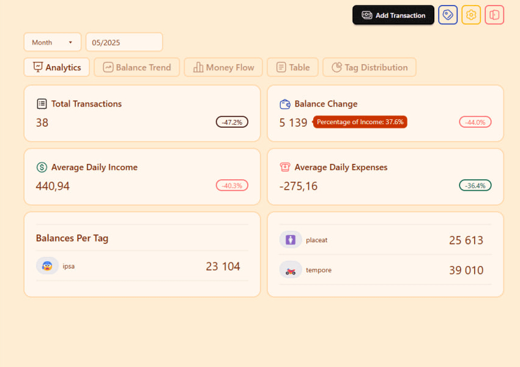
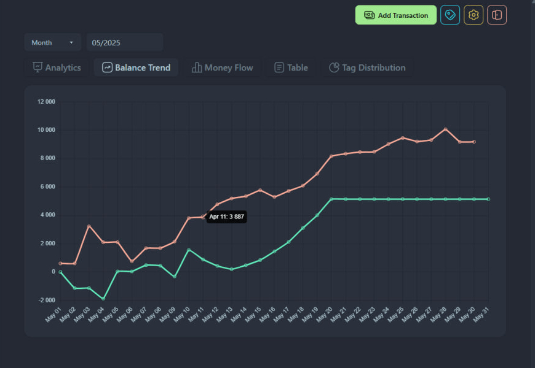
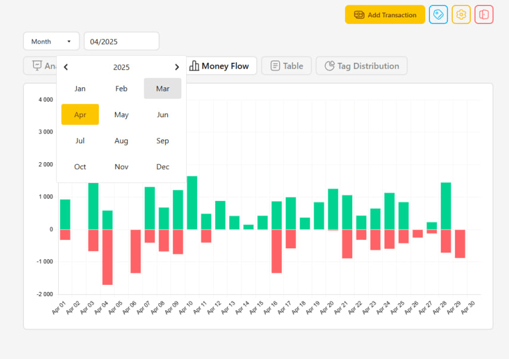
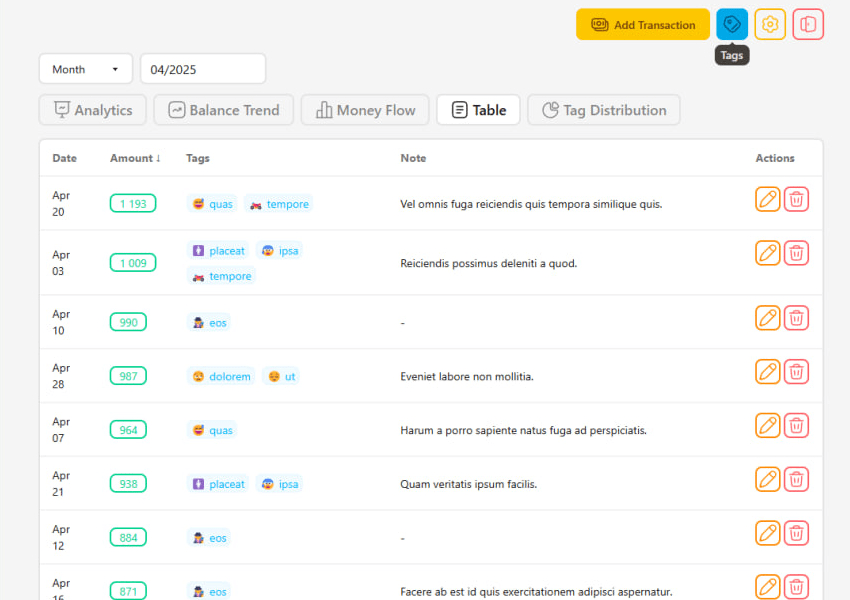
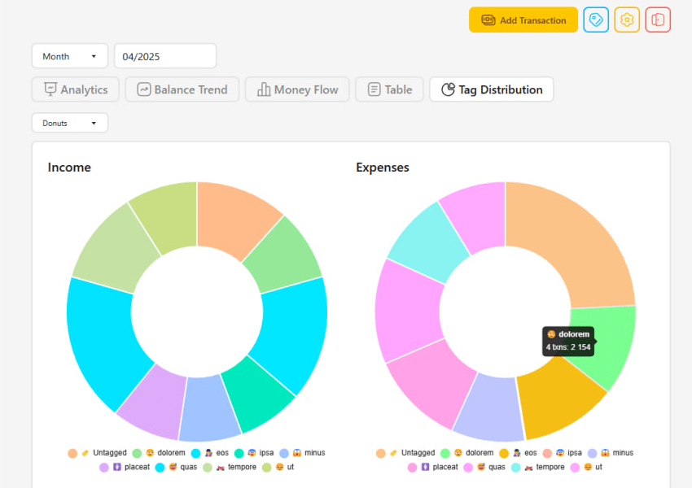
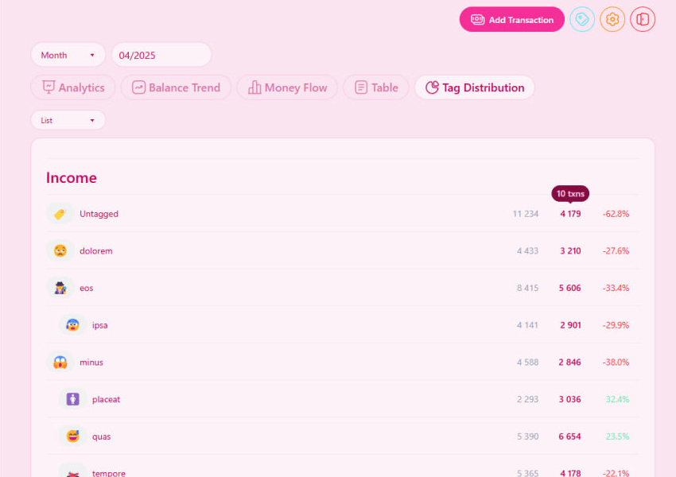
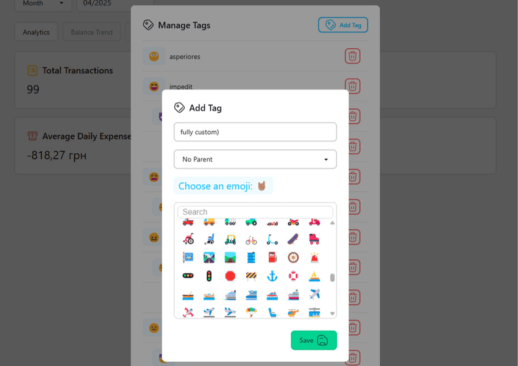
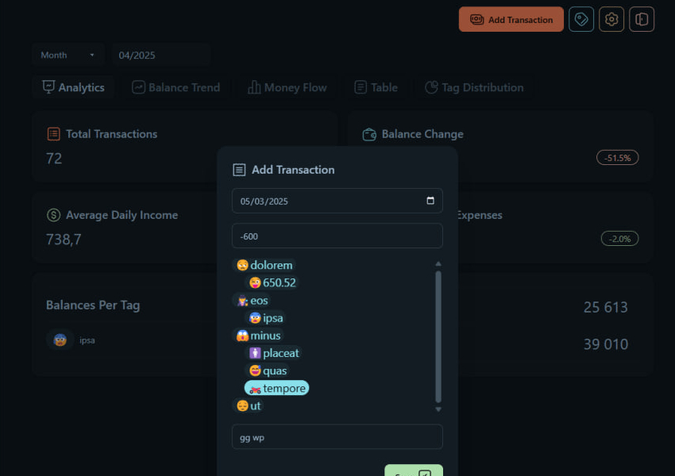

# FundsFlow

Personal finance tracker

## Features

- Transactions:
  - date, amount, tags, note
- Recurring transactions:
  - daily, weekly, monthly, yearly
  - ends after a date or a set number of times
- Budgets:
  - per-tag spending limits
  - pause/resume, full history of past limits
- Tags:
  - fully customizable, with emojis 😋
  - hierarchical (parent/child)
- Telegram bot:
  - quick-add by chatting
  - bot-first registration/login
  - budget and digest alerts, mute/unmute
- Filter:
  - by date: week, month, year
  - by tags: in development
- Settings:
  - money/date format
  - 30+ themes
- Helpful Insights:
  - Analytics
  - Balance Trend
  - Money Flow
  - Table
  - Tag Distribution
    - Donuts
    - List

|  |  |  |
| ---------- | ---------- | ---------- |
|  |  |  |
|  |  |  |
|  |  |  |

